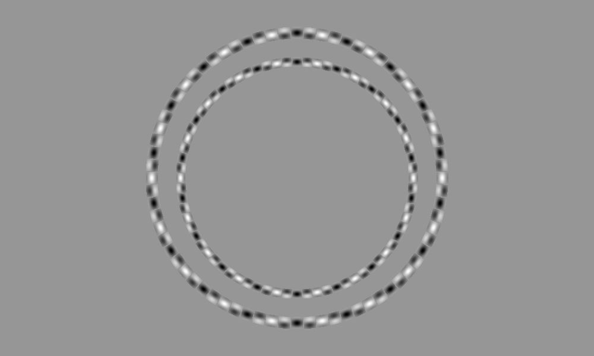
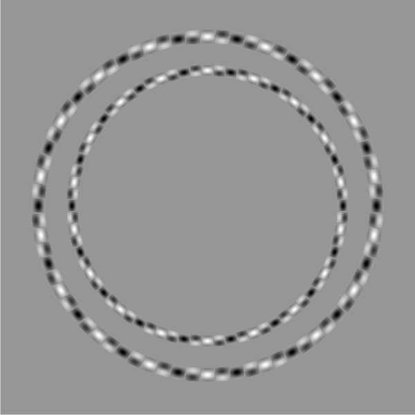

Prof. Akiyoshi Kitaoka makes images using the so-called "Popple illusion".
Using phase-shifted Gabor patches, these illusions cause your visual system to
misinterpret concentric circles as non-concentric or even as spirals.

His website is phenomenal:

* [http://www.psy.ritsumei.ac.jp/~akitaoka/ranso.html](http://www.psy.ritsumei.ac.jp/~akitaoka/ranso.html)
* [http://www.psy.ritsumei.ac.jp/~akitaoka/popple-e.html](http://www.psy.ritsumei.ac.jp/~akitaoka/popple-e.html)
* [http://www.psy.ritsumei.ac.jp/~akitaoka/](http://www.psy.ritsumei.ac.jp/~akitaoka/)

Also worth reading is the original paper _"A new illusion demonstrates long-range processing"_
[https://www.sciencedirect.com/science/article/pii/S0042698900001279](https://www.sciencedirect.com/science/article/pii/S0042698900001279). It's very approachable.

I love research papers that use illusions to reverse engineer our visual
system. It's cool to think that, as recently as the year 2000, we're finding
new and intriguing visual illusions that teach us something about our brain. In
this case, that our visual system has a global mechanism for orientation
averaging.
