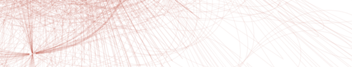
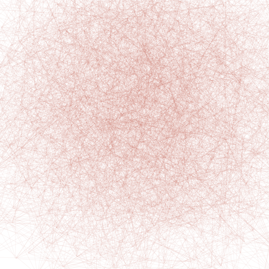
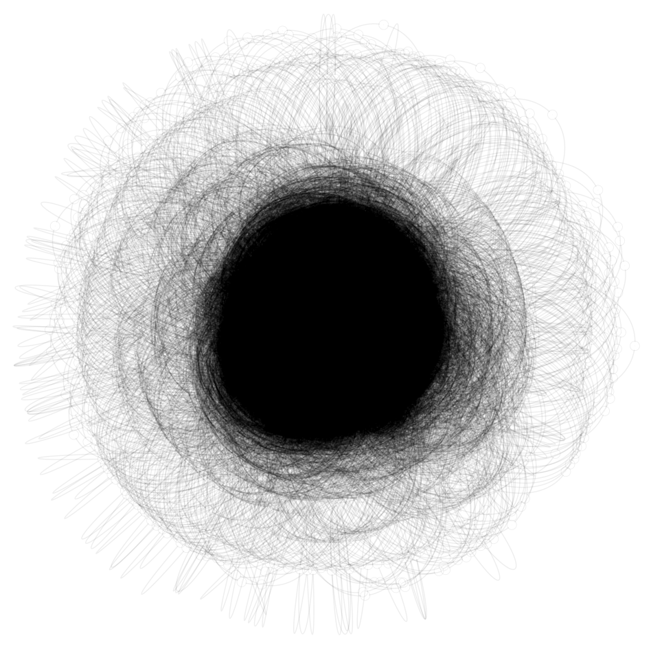
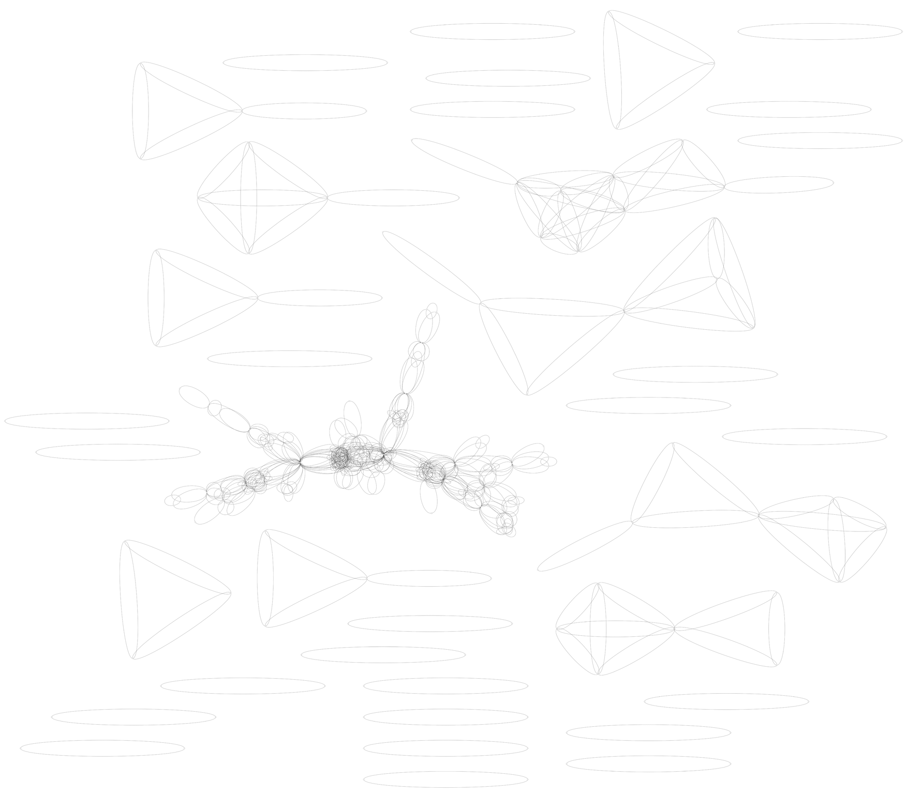

I have a few idaes for startups with a graph-like structure and found myself exploring the topic of graph visualization. I decided to see if I could generate some graphs containing hundreds of thousands of edges. Tools of choice: bash, python, and GraphViz1.

**RandomSubset(p)**

Using my template I first made a graph of a random subset of (p \* 100)% of the 2-tuples in the cartesian product between the first _X_ integers:

\[(a, b) for a in range(_X_) for b in range(_X_) if random() < p\]

Here's the middle of the graph for p=0.02:

**CommonFactors(x, y)**

Next, I decided to see what the graph of integers < _X_ that have more than _Y_ factors in common.

\[(a, b) for a in range(_X_) for b in range(_X_) if len(common\_factors(a,b)) > _Y_\]

 

**Here's the graph for x=10 000, y=5:**

 **A focus on the heavily linked part of for x = 10 000, y = 5**

**Here's one for x=10 000, y=30**

I found them all to be quite beautiful.

## The Code

If you want to check out the source code, here's the github: [https://github.com/stephenbalaban/biggraphs](https://github.com/stephenbalaban/biggraphs).

Note: The first image is a section of an earlier iteration of the CommonFactors graph.

\[1\] GraphViz project: http://graphviz.org - I used the point shape for the nodes here's the part of the code that describes my graph style:

graph gengraph {
        graph \[bgcolor="#FFFFFF", outputorder="edgesfirst", dpi=1000\];
        node \[width=0.0008, fixedsize=true, shape=point, color="#00000099"\];
        edge \[penwidth=0.1, color="#00000099"\]graph \[bgcolor="#FFFFFF", outputorder="edgesfirst", dpi=1000\];
        a -- b;
        b -- a;
        a -- c;
        c -- a;
        a -- d;
        b -- d;
        c -- d;
}
