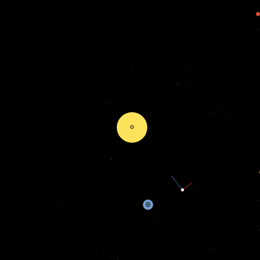

Recently, I've been really excited about [Elm](http://elm-lang.org). I'm currently using it for the on-hat web application for Lambda Hat. I've really enjoyed the FRP style and the Signals control flow mechanism.

When I was first getting started, I put together a little orbital mechanics game I call Gravity. Feel free to check out the source and demo below:

**Source:** [https://github.com/stephenbalaban/Gravity](https://github.com/stephenbalaban/Gravity)

**Demo:** [./images/gravity.html](./images/gravity.html)
