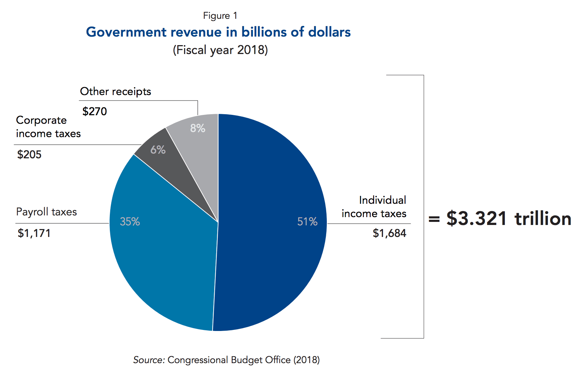

Originally published 2012-09-02, updated on 2019-11-02

Source: Committee for Economic Development.

What services would you expect from a company that had $2.2 trillion (now $3.321 trillion) in revenue?
